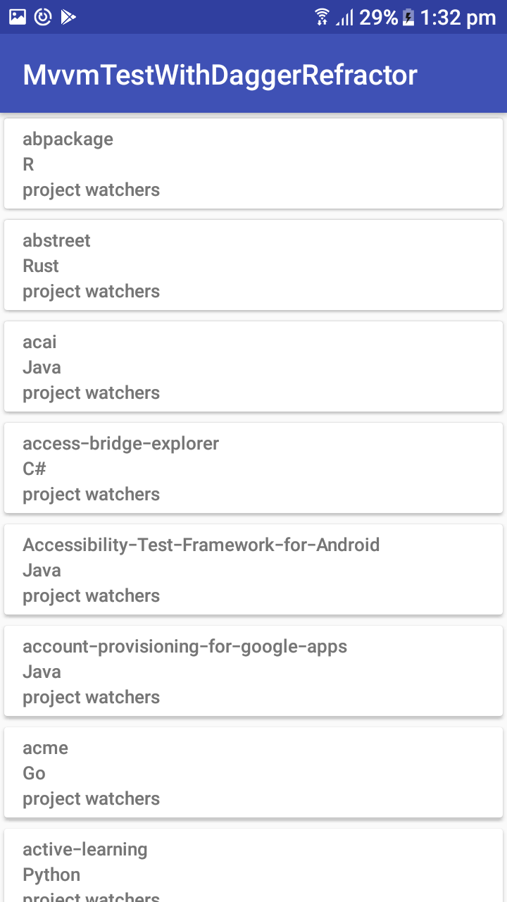
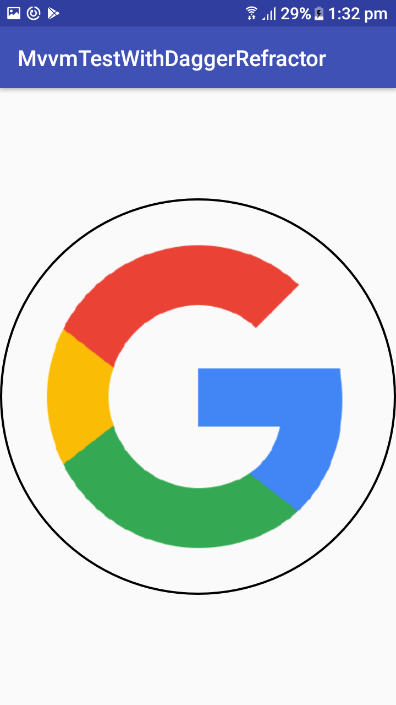

# MVVMTestWithDagger

This is sample project that shows the usage of Android clean architecture called MVVM along with
Android dependency injection library called Dagger2.

The project uses retrofit to fetch the list of github user from google.
The project contains one activity called MainActivity and two fragment called projectListFragment and projectDetailFragment.
In the first fragment called projectListFragment, List of github user is fetched and on clicking to the particular user, it will navigate
to the detail page where particular user detail like followers,following is fetched.

      

